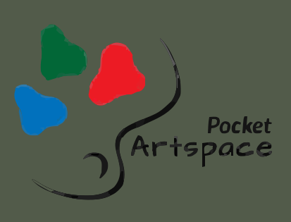
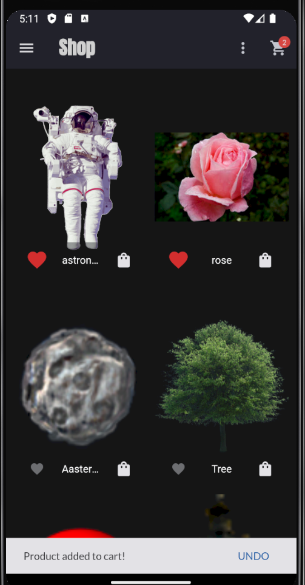
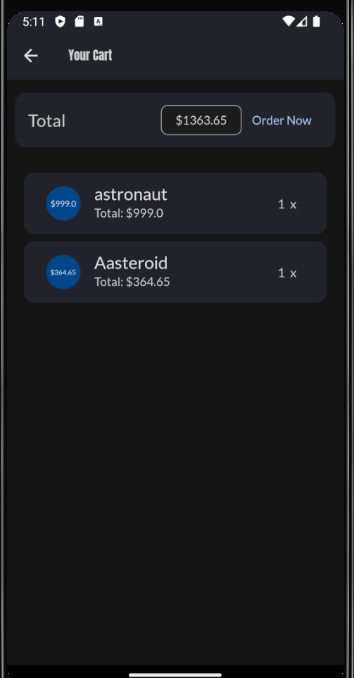
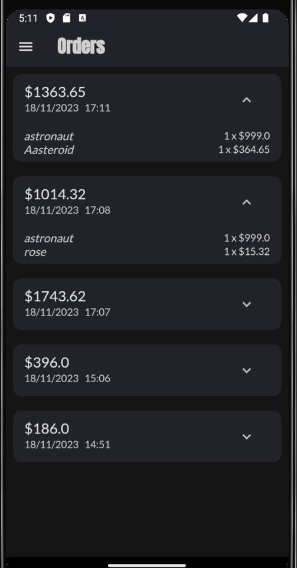
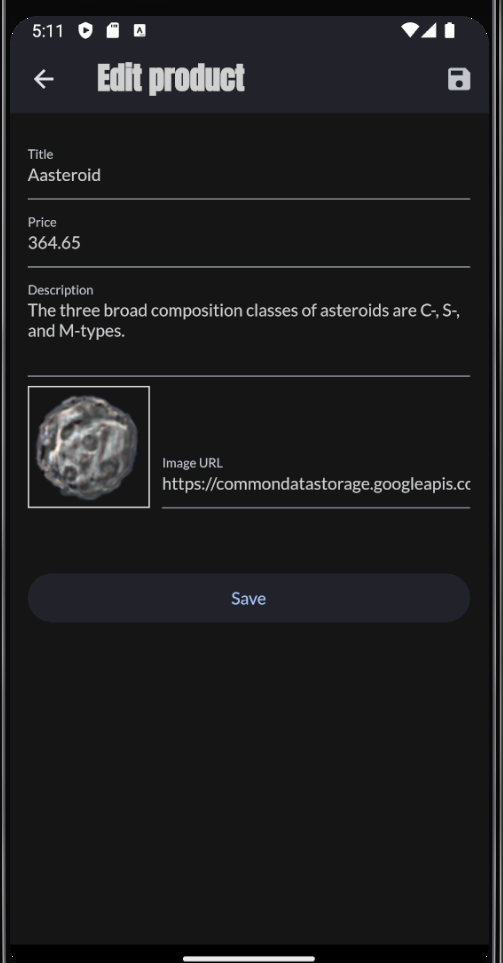
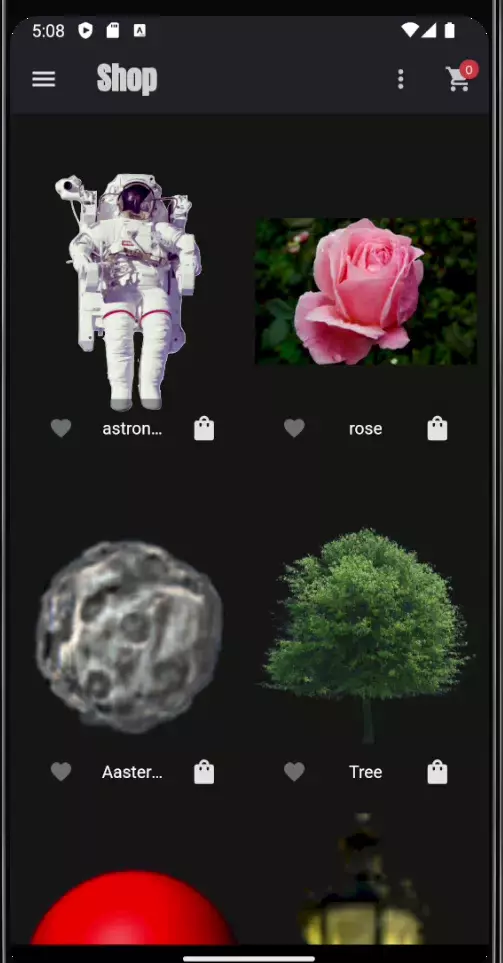

# Base store.

> Marketplace on flutter.

---

[Description](#description) •
[Project setup](#project-setup) •
[Features](#features) •
[How To Use](#how-to-use) •
[Project Status](#project-status) •
[Room for Improvement](#room-for-improvement) •
[License](#license) •
[Contact](#contact)

## Description

Marketplace on Flutter.
Storing data in a Firebase database.
Authorization and authentication.
The user can add and adjust their products.
Ability to add products to favorites.
Ability to add products to cart and create an order with a list of products.
View orders.

## Project setup

- Clone this repo to your desktop.
- May be needed run `flutter packages get` or click Get packages button in IDE to install all the dependencies.
- Launch the emulator or connect your smartphone.
- Run the application in your IDE (Run -> Run Without Debugging for VSCODE).
- Enjoy.

## Features

- Editing product;
- Favorites filter;
- Firebase storage;
- Flutter provider;
- Google fonts;
- User Authentication;

## How To Use

## Project Status

Project is: _in progress_

## Room for Improvement

To do:

- [ ] Design refactoring.
- [ ] Adding User Authentication.

Improvement:

- [ ] Add animation.
- [ ] Add localization;
- [ ] Implement toggle day-night;

## License

This project available under the [MIT](../LICENSE.txt).

## Contact

Created by [@RimidalU](https://www.linkedin.com/in/uladzimir-stankevich/) - feel free to contact me!

